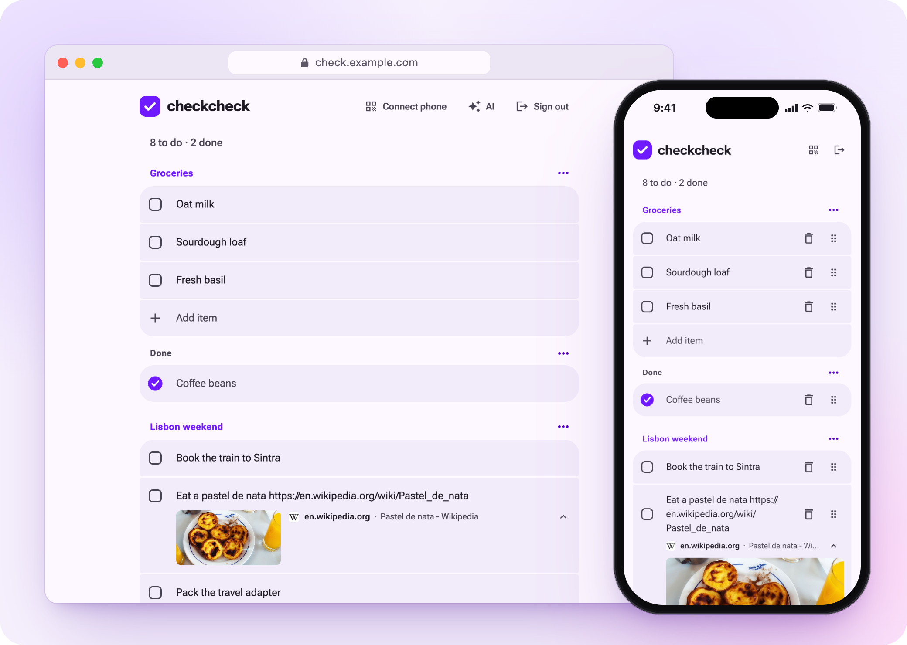

# CheckCheck

<picture>
  <source media="(prefers-color-scheme: dark)" srcset="docs/screenshot-dark.png">
  
</picture>

Your personal checklist, on your own server. Groceries, packing lists, the things you keep meaning to do. One Go binary serves the web app, the API the iPhone app talks to, and an MCP server, so you can ask Claude to add oat milk and find it on your phone at the store.

## Run it

```sh
docker build -t checkcheck https://github.com/mjarkk/checkcheck.git#main:server
docker run -d --name checkcheck -p 8080:8080 -v checkcheck-data:/data \
  -e CHECKCHECK_TOKEN="$(openssl rand -hex 32)" checkcheck
```

Open http://localhost:8080 and paste the token. Leave out `CHECKCHECK_TOKEN` and the server makes one, logs it once and keeps it in the data dir.

| Env                   | Default                    |                              |
| --------------------- | -------------------------- | ---------------------------- |
| `CHECKCHECK_TOKEN`    | generated                  | The only login there is      |
| `CHECKCHECK_DATA_DIR` | `data` (`/data` in Docker) | Database and generated token |
| `CHECKCHECK_ADDR`     | `:8080`                    | Listen address               |

## Connect

- **Phone**: **Connect phone** in the web app, then scan the code with the app. It isn't in the App Store, so build it from [mobile/](mobile/README.md) (needs Xcode 27).
- **Claude** (web, desktop and mobile): add a custom connector with the URL `https://<host>/mcp/<token>` and **No sign-in**. Claude connects from Anthropic's cloud, so the server needs a public HTTPS address.
- **Claude Code**:
  ```sh
  claude mcp add --transport http --scope user checkcheck https://<host>/mcp --header "Authorization: Bearer <token>"
  ```
- **Anything else**: **Connect AI** in the web app has the steps per client, with your URL and token filled in.

## Develop

```sh
mise install
mise run dev
```

Open http://localhost:5173 and sign in with `dev`. The web app hot-reloads, the Go server runs on `:8181`, and dev data lives in `server/data/`. Open the `Network:` URL Vite prints instead, and the **Connect phone** QR code gets an address your phone can reach.
